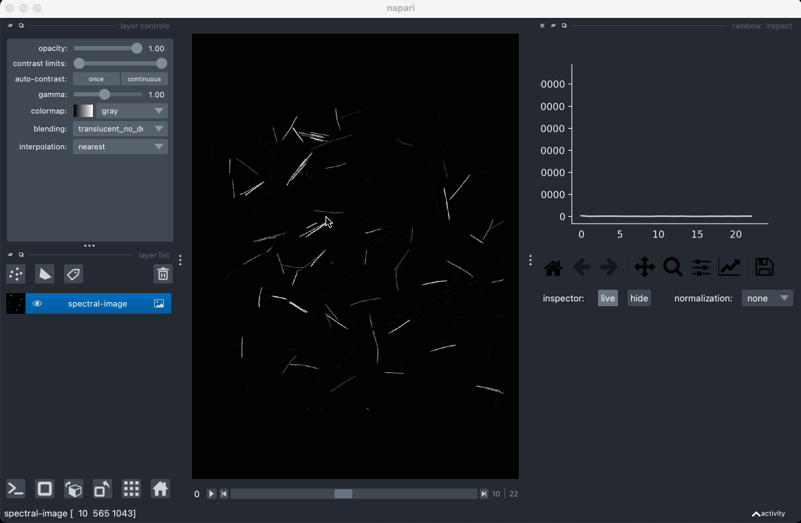
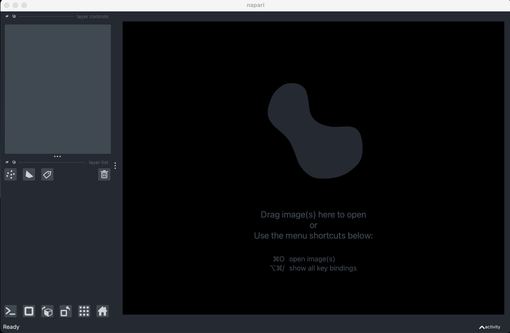

# rainbow

Welcome! You've found the repository for rainbow 🌈 -- a [napari] plugin for inspecting and unmixing spectral images. This project is in pre-alpha, so expect some glitches. Current functionality includes the ability to inspect pixel spectra and perform linear unmixing.

## Installation

You can install `rainbow` via [pip]:

    pip install napari-rainbow

## Usage

At the moment, rainbow contains an inspector widget for viewing pixel spectra and an unmixing widget for performing linear unmixing. Here's a quick introduction to each of these components.

### Inspector

To view the spectra that make up your spectral image, select the `Inspect` widget from the `rainbow` dropdown menu. The widget will plot a live readout of the pixel spectra as you move your cursor over the image.

The `normalization` setting allows you to easily view and compare signals of different intensities.

### Unmixing

To determine the amount of fluorescent label that exists within your spectral image, we can perform unmixing using the nonnegative least squares algorithm. This process requires that you have an endmember CSV file corresponding to the fluorophores used to label your sample. You can create this endmember file yourself or generate one from [FPbase](https://www.fpbase.org/). Note that the wavelength range of your endmembers must match that of your spectral image.

To perform unmixing, first open your spectral image. Then open the `Metadata` widget to identify which dimension corresponds to your spectral information. Next, open the `Unmix` widget and click the `import` button. The importer only accepts CSV files representing your endmembers. If your CSV file is formatted properly, you will see the endmember spectra plotted for you to review. When you are ready, click `unmix` to start the nonnegative least squares algorithm. The spectral image will be replaced by the unmixed channel image.

## License

Distributed under the terms of the [BSD-3] license, "rainbow" is free and open source software

## Issues

If you encounter any problems, please [file an issue] along with a detailed description.

[napari]: https://github.com/napari/napari
[pip]: https://pypi.org/project/pip/
[BSD-3]: http://opensource.org/licenses/BSD-3-Clause
[file an issue]: https://github.com/brossetti/rainbow/issues